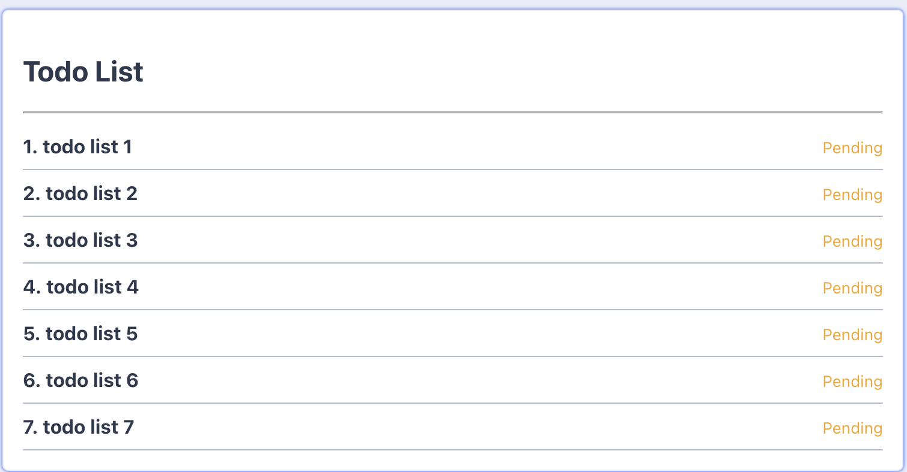
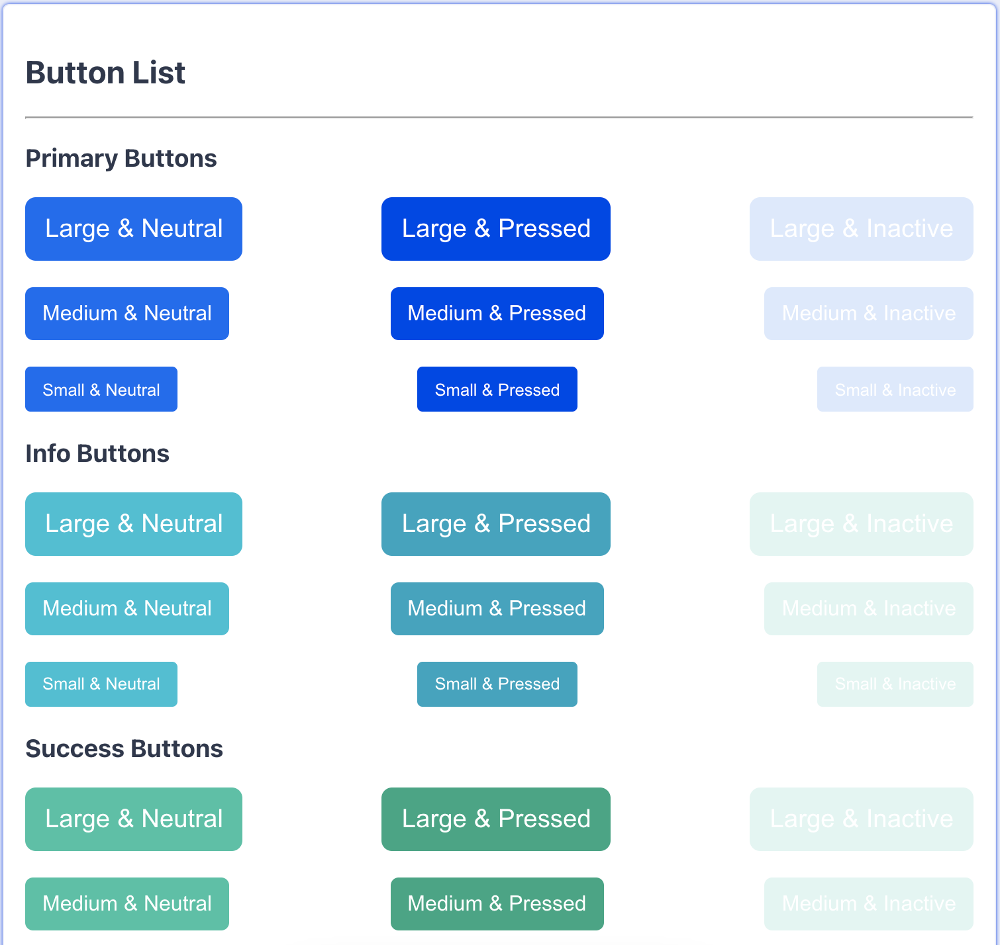
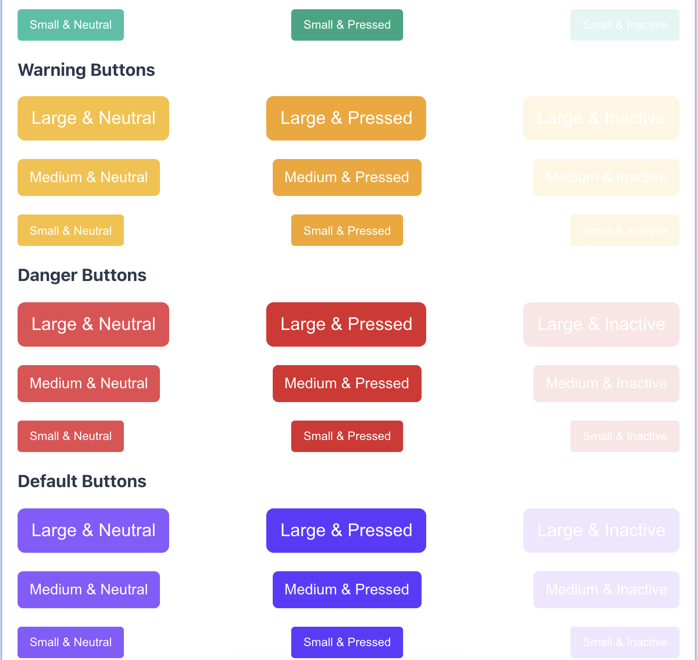

# ZenSmart React Test
Here I manage two defferent functions: 
- Todo list
- Dynamic buttons

## Instalation instractions
```
- git clone https://github.com/Azim1993/ZenSmartReactTest.git
- cd ZenSmartReactTest
- yarn install / npm install
- yarn start / npm start
```

## Buttons component guideline 
**Component Use** : `<Button />` or `<Button></Button>` <br>
**Props list** : 
| Props         | Posible values                                        |
| ------------: | :---------------------------------------------------- |
| text          | To display button text                                |
| size          | `small` `medium` `large`                              |
| type          | `button` `submit`                                     |
| variant       | `default` `success` `danger` `warning` `info` `primay`|
| status        | `neutral` `pressed` `inactive`                        |
| onClick       | Handles on click event                                |

## Screenshots




